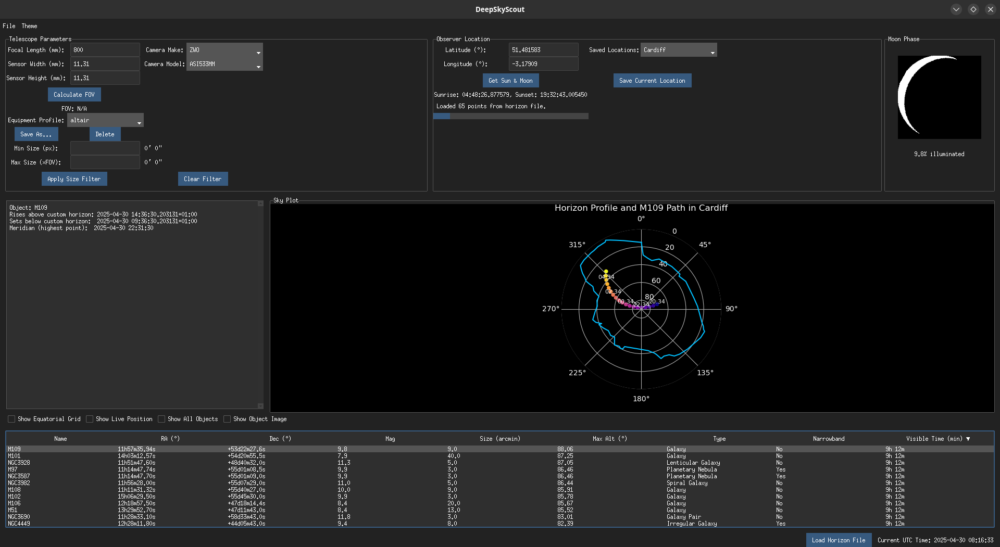

# DeepSkyScout



DeepSkyScout is a cross-platform Python desktop application for planning deep-sky imaging sessions using a custom artificial horizon profile (e.g., mountain skyline) to model when targets clear your local skyline, similar to Stellarium’s horizon feature. It also integrates NASA’s DSS2 Red survey cutouts for quick field previews.


## Features

- **Artificial Horizon Modeling**: Load a simple two-column horizon file (azimuth, altitude) to define your local skyline. Objects are flagged as visible only when they clear this custom horizon.
- **Deep-Sky Object Catalog**: Comes with an SQLite database of well-known nebulae, galaxies, and clusters (RA/Dec, magnitude, angular size, object type).
- **Interactive Sky Plot**: Polar-coordinate plot showing horizon line and object paths, color-coded by time. Toggle equatorial grid and live UTC sky-clock marker.
- **Sorting & Filtering**: Sort by name, RA/Dec, magnitude, size, maximum altitude, or visible minutes. Filter by object size (pixels or FOV ratio), magnitude, and visibility duration. “Show All” mode greys out currently hidden targets.
- **DSS2 Red Image Cutouts**: Fetch or bulk-download NASA DSS2 Red thumbnails via Astroquery/SkyView. Images are cached in `imaging/images/`
- **Equipment & Location Profiles**: Define and save camera/telescope setups (focal length, sensor dimensions) and observing sites (latitude/longitude).
- **Batch Image Downloader**: Single-click “Download All Images” to cache every target’s survey cutout with a progress bar.

## Prerequisites

- Python 3.8+  
- Dependencies
  ```bash
  astropy
  astroquery
  pillow
  scipy
  numpy
  matplotlib
  pytz
  ttkbootstrap
  ```

## Installation

1. Clone the repository:
   ```bash
   git clone https://github.com/rhodrithomas1/DeepSkyScout.git
   cd DeepSkyScout
   ```
2. (Optional) Create and activate a virtual environment:
   ```bash
   python -m venv venv
   source venv/bin/activate    # Linux/macOS
   venv\\Scripts\\activate   # Windows
   ```
3. Install dependencies:

   
## Usage

1. Launch the app:
   ```bash
   python main.py
   ```
2. **Load Horizon File**: In **File → Load Horizon File**, select your custom horizon text file (two columns: azimuth, altitude).
3. **Select Location & Equipment**: Save or choose a latitude/longitude and camera profile.
4. **Refresh Visibility**: App computes rise/set and visible minutes for each object.
5. **Browse Catalog**: Click any object to plot its path and view rise/set/meridian times. If enabled, a DSS2 Red thumbnail pops up.
6. **Batch Download**: Use **File → Download Images** to cache all survey images locally.

## Horizon File Format

```
0    0
10   1.5
20   3.0
...  ...
350  0
```
Each line is `AZimuth(deg)  ALTitude(deg)`; blank lines and invalid entries are ignored.

## Image Caching

All fetched DSS2 cutouts are saved under:
```
imaging/images/
```
Filenames follow:
```
<ObjectName>_<Survey>_<RA>_<Dec>_<Width>x<Height>.png
```
so repeat requests load from disk instantly.

## Contributing

Bug reports and pull requests welcome! Please fork the repo, make your changes, and submit a PR.

## License

This project is released under the [Creative Commons Attribution-NonCommercial 4.0 International License](https://creativecommons.org/licenses/by-nc/4.0/).

